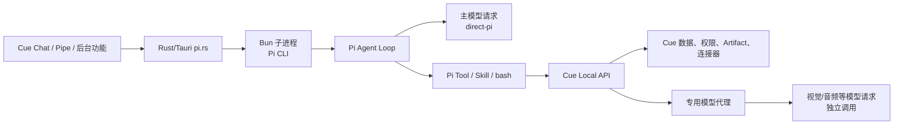

# Cue Agent 能力供给层

<!-- doc-covers: apps/screenpipe-app-tauri/src-tauri/src/pi.rs, crates/screenpipe-core/src/agents/pi.rs, crates/screenpipe-engine/src/routes/cloud_proxy.rs, crates/screenpipe-core/assets/skills/screenpipe-api/SKILL.md, crates/screenpipe-core/assets/skills/screenpipe-api/cloud_media_analysis_block.md, apps/screenpipe-app-tauri/src-tauri/assets/extensions/web-search.ts, apps/screenpipe-app-tauri/src-tauri/assets/extensions/mcp-bridge.ts, apps/screenpipe-app-tauri/src-tauri/assets/extensions/save-artifact.ts, apps/screenpipe-app-tauri/src-tauri/assets/extensions/live-views.ts, apps/screenpipe-app-tauri/src-tauri/assets/extensions/connection-gate.ts, crates/screenpipe-core/assets/extensions/sub-agent.ts -->
<!-- doc-verified: b6bed101f1763d9baf570e2b2cdedeca56152291 -->
> **Current。** 本文按上述提交核验。产品层名称使用 Cue，源码和路径仍保留 Screenpipe 命名。

## 1. 这项能力是什么

**Cue（源码名 Screenpipe）通过 Pi 运行 Agent 主循环，再将自己的数据、动作和专用模型能力提供给 Pi。**

| 部分 | 在 Cue 中承担什么 | 是否直接产生动作 |
| --- | --- | --- |
| Pi | 运行主模型、决定是否调用工具、组织最终回答 | 决定调用 |
| Skill | 把 Cue API 的用途、参数、权限和使用时机告诉模型 | 不产生动作 |
| Pi extension Tool | 把高频或有明确边界的动作注册成结构化 Tool | 发起一个 Tool 调用 |
| Cue Local API | 执行数据查询、权限校验、Artifact 注册和本地代理 | 执行宿主能力 |
| Cloud / Provider API | 承接真正的远程模型请求或外部服务请求 | 产生外部请求 |

Skill 向模型提供操作规则，Tool 提供结构化调用入口，Cue Local API 执行宿主能力，Pi 决定何时使用它们。模型的判断与宿主执行因此分开：Pi 不直接写 Cue 数据库；外发请求则由 Cue 的权限与代理边界承接。

## 2. Pi 在 Cue 中怎么运行

**当前实现通过外部 Bun 子进程运行 Pi，而不是在 Screenpipe Rust 代码里直接调用 Pi SDK 的 `createAgentSession`。**



`pi_start_inner` 会创建并配置 Pi 子进程，设置专用 `PI_CODING_AGENT_DIR`、Provider 环境变量、Local API 地址和本地 API Key。Pi 的主模型请求由 Pi Runtime 发起，归为 `direct-pi`。

因此，`direct-pi` 描述的是**主模型请求由 Pi 发起**，不是 Cue 是否把 Pi SDK 嵌进了自己的进程。

## 3. Skill、Tool 和 API 的关系

### 3.1 Skill 只提供使用规则

`screenpipe-api` Skill 是落到 Pi 工作目录中的 `SKILL.md`。它告诉 Pi 如何查询本地数据、读取 Frame、访问会议资料、保存记忆，以及在需要多模态理解时调用 `/v1/chat/completions`。

Skill 自己不会：

- 注册一个新的 Pi Tool；
- 代替 Pi 发 HTTP 请求；
- 直接通过模型调用另一个模型；
- 绕过当前会话的 Tool 白名单。

Pi 是否能按照 Skill 调 API，仍取决于这个会话是否获得 `bash` 或对应的正式 Tool。

意图会话（intent-card，见 `doc/FEATURE_INTENT_CARDS.md` §6）的技能面与 Chat 对齐：pi 会自动发现全局技能目录，项目级镜像剥离对它无效（轨迹取证 01a02f23/01a02f15/01a02f91 列出全部 18 个技能；2026-08-24 修订 D7）。该无人值守会话的隔离边界因此完全落在工具白名单上——bash 与一切写侧工具不进白名单；技能正文若被注入引导 `sp_mcp_call` 产生外部副作用，是已知并接受的残留面。

### 3.2 Extension 注册结构化 Tool

当前 Cue 会向 Pi 安装若干 extension。它们通过 `pi.registerTool()` 注册结构化动作：

| Tool | Extension | 后端动作 |
| --- | --- | --- |
| `sp_web_search` | `web-search.ts` | 请求 Cue Cloud 的公网搜索接口 |
| `sp_mcp_list_tools` | `mcp-bridge.ts` | 查询用户注册的 MCP 服务和工具 |
| `sp_mcp_call` | `mcp-bridge.ts` | 代理调用用户注册的 MCP 工具 |
| `save_artifact` | `save-artifact.ts` | 调本地 `/artifacts/register` 登记产出 |
| `screenpipe_live_view_propose` | `live-views.ts` | 提议 Live View 变更 |
| `screenpipe_live_view` | `live-views.ts` | 读取或执行 Live View 操作 |
| `screenpipe_list_connections` | `connection-gate.ts` | 查看连接状态 |
| `screenpipe_connect_app` | `connection-gate.ts` | 发起连接授权流程 |

这些 Tool 由 Cue 通过 Pi extension 接入。Pi 选择并调用它们，extension 或 Cue 本地服务完成实际请求。

### 3.3 Skill + API 覆盖长尾能力

本文重点讨论两种常见入口：

| 方式 | Pi 怎么调用 | 适合什么 |
| --- | --- | --- |
| 正式 Tool | Pi 传结构化参数给 extension | 参数稳定、需要清晰授权和审计的动作 |
| Skill + API | Pi 读取 Skill 后，用允许的 `bash` 发 HTTP 请求 | 长尾查询、接口较多或仍在变化的能力 |

此外，MCP bridge 通过 `sp_mcp_list_tools` 与 `sp_mcp_call` 接入用户注册的 MCP 服务；extension hook 还能控制 Pi 生命周期或拦截调用。这两类机制不应混入“Skill + API”。

## 4. 两个常见调用场景

### 4.1 普通数据查询

```text
Pi 主模型
  → 读取 screenpipe-api Skill
  → 用 bash 调 Cue Local API
  → Cue 校验本地 API Key
  → 查询本地数据
  → 返回 JSON / CSV / 媒体引用
  → Pi 继续回答
```

这条路径不因查询数据而新增模型请求。Pi 查询 Cue 数据不等于 `pi-mediated`。

### 4.2 会议媒体分析

```text
Pi 主模型
  → 发现 OCR / Transcript 不足
  → 读取媒体分析 Skill 规则
  → 用 bash 调 localhost:3030/v1/chat/completions
  → Cue Local API 的 cloud proxy 读取云端凭证
  → 转发到 api.screenpipe.com/v1/chat/completions
  → 专用视觉/音频模型返回结果
  → Pi 把结果写入最终摘要
```

媒体分析发生时，调用可分为两类：

| 请求 | 发起者 | 用途 | 归类 |
| --- | --- | --- | --- |
| Pi 主模型请求 | Pi Runtime | 规划、查询、组织回答；一个会话可有多轮 | `direct-pi` |
| 媒体模型请求 | Cue Cloud Proxy 代表媒体能力发起 | 分析音频、图片或视频帧；只在 Pi 触发媒体分析时出现 | `pi-mediated` |

`pi-mediated` 不是 Skill 的名字，也不是某个固定 Tool 的名字。它表示：**Pi 的一次工作间接触发了第二笔独立模型请求。**

如果 Pi 调 API 只查询 OCR 或数据库，没有第二笔模型请求，那是普通 Tool/API 调用，不应标成 `pi-mediated`。

## 5. 媒体分析的代理边界

**Pi 判断是否需要媒体理解，Cue 提供受控的媒体模型入口。**

| 责任 | Pi | Cue |
| --- | --- | --- |
| 判断文本是否足够 | 负责 | 不负责 |
| 选择 Frame 或 Audio 数据 | 按 Skill 规则决定 | 校验请求边界 |
| 媒体请求的 Cloud Token | bash 子 shell 不持有 | AppState 持有 |
| 选择媒体模型 | 按 Skill 指定模型请求 | 代理并转发 |
| 处理云端错误 | 读取错误并决定重试或降级 | 返回 `cloud_token_missing`、`upstream_unreachable` 等明确错误 |
| 最终写摘要 | 负责 | 不负责 |

本地 proxy 会把 Pi 的请求转发到 Cue Cloud API，并由应用内的 `AppState` 持有用户云端凭证。原生 Pi 路径会向 Pi 子进程注入 `SCREENPIPE_API_KEY` 供主模型访问 Provider；但其 bash 子 shell 会清理该变量。媒体分析经本地 API 和 proxy 转发，bash 子 shell 不直接获得 Cloud JWT。

这种设计的收益是：

- 普通文本问题不必上传音频或图片；
- 媒体模型可以独立于主 Agent 模型升级；
- Cloud JWT 不进入 Pi 的 bash 子 shell；
- 媒体调用可以单独做权限、费用和 Trace。

代价是一次用户请求可能产生多笔模型请求，延迟、成本、失败和观测边界都会增加。

## 6. 当前专用 Tool 与 Skill API

### 6.1 本地产品能力

| Tool | 说明 |
| --- | --- |
| `save_artifact` | 将用户需要长期查找的 Markdown、JSON、文本或代码产出登记进 Artifacts |
| `screenpipe_live_view` | 读取或操作结构化 Live View |
| `screenpipe_live_view_propose` | 提议 Live View 定义变更 |
| `screenpipe_list_connections` | 查询用户连接状态 |
| `screenpipe_connect_app` | 请求用户授权并连接外部应用 |

这些 Tool 背后调用本地 API 或应用内授权流程。

### 6.2 外部能力代理

| Tool | 说明 | 外部边界 |
| --- | --- | --- |
| `sp_web_search` | 搜索公网内容 | 请求离开设备 |
| `sp_mcp_list_tools` | 读取用户 MCP 服务暴露的工具 | 取决于 MCP 服务 |
| `sp_mcp_call` | 调用用户 MCP 服务 | 可能产生外部副作用 |

外部能力不能因为被包装成 Pi Tool，就被当成本地能力。权限、日志、失败和数据外发仍要按外部调用处理。

### 6.3 Skill 直接覆盖的长尾 API

`screenpipe-api` Skill 当前覆盖本地 REST API 的多类端点：

| 类型 | 例子 | 是否是正式 Pi Tool |
| --- | --- | --- |
| Timeline / Activity | `/activity-summary`、`/search` | 否 |
| OCR / Frame | `/elements`、`/frames/{id}` | 否 |
| Audio / Meeting | 音频、会议和转录相关端点 | 否 |
| Memory | `/memories` | 否 |
| Media inference | `/v1/chat/completions` | 否 |

这些接口由 Skill 提供使用规则，Pi 用已有的 bash 或其他允许的调用能力访问。

## 7. Subagent 不等于 `pi-mediated`

Subagent extension 走的是另一条路径：

```text
父 Pi
  → 执行 sub-agent run
  → extension 启动新的 Pi Bun 子进程
  → 子 Pi 发起自己的主模型请求
  → 子 Pi 输出文本
  → 父 Pi 收到工具结果
```

子 Pi 的主模型请求仍属于 `direct-pi`。它不是 Cue API 代替子 Pi 调了第二个模型。

因此应这样记录：

| 场景 | 父 Pi 看到的内容 | 子请求归类 |
| --- | --- | --- |
| 父 Pi 调子 Agent | Tool / 命令调用 | 父调用记录 |
| 子 Pi 调主模型 | 独立 Pi Session | 子 Session 的 `direct-pi` |
| 子 Pi 调媒体 API | 子 Session 触发第二笔模型请求 | 子 Session 关联的 `pi-mediated` |

父子 Session、父 Tool Call 和子模型请求不能合并成一条模型调用，否则无法解释成本、失败和并发。

## 8. Trace 观测要求

**只采 Pi hook 不足以覆盖 Cue 的全部模型调用。**

| 观测对象 | Pi extension 能否直接观察 | 应记录什么 |
| --- | --- | --- |
| Pi 主模型请求 | 能观察 Agent 生命周期和消息结果；Provider payload 是否完整取决于 hook | Session、Turn、Message、Tool、Usage |
| 正式 Pi Tool | 能观察 Tool 生命周期 | Tool 名、参数摘要、结果、错误 |
| Skill 指导的 bash API | 只能看到 bash 命令和返回；不等于完整模型请求 | API 路由、状态码、输入模态、结果 |
| Cue Cloud Proxy | Pi extension 不能直接观察 | Proxy 请求、模型、模态、Usage、Cost、Latency |
| 子 Pi | 每个子进程可单独装 extension | 父子 Session 关系 |

ATA 或 Cue 内部 Trace 层至少要把以下三层关联起来：

```text
parent Pi Session
  → Tool Call / bash command
    → Cue API request
      → model invocation
```

`pi-mediated` 的成本和媒体数据边界只能从 Cue API 或 Cloud Proxy 侧确认，不能从 Pi 的最终文本反推。

## 9. 能力入口选择

| 需求 | 首选 | 原因 |
| --- | --- | --- |
| 只读 Cue 数据 | Local API + Skill，或稳定后收敛为 Tool | 先覆盖面，后提高参数约束 |
| 写入 Cue 数据 | 正式 Tool | 需要确定性闸门和审计 |
| 用户可见的交付物 | `save_artifact` Tool | 需要固定保存语义 |
| 用户授权连接 | `screenpipe_connect_app` Tool | 需要中断、确认和失败态 |
| 公网搜索 | `sp_web_search` Tool | 需要明确外发边界 |
| 用户 MCP | `sp_mcp_list_tools` + `sp_mcp_call` | Tool 名和参数由外部服务动态提供 |
| 音频、图片、视频理解 | Skill + 受控 API/Proxy | Pi 决定是否需要，Cue 控制凭证和媒体边界 |
| 并行拆分任务 | Subagent extension | 需要独立 Pi Session，不是第二模型 API |

## 10. 验收标准

| # | 判据 |
| --- | --- |
| 1 | 移除 Skill 不会删除已注册 Tool；Skill 不会凭空注册 Tool |
| 2 | 没有 `bash` 的 Pi Session 不能因为读到 Skill 就获得 API 调用能力 |
| 3 | 正式 Tool 的参数、权限、开始、结束和错误都可单独记录 |
| 4 | 普通数据查询不被误记为 `pi-mediated` |
| 5 | 媒体分析同时产生 Pi 侧触发记录和 Cue API/Proxy 侧模型调用记录 |
| 6 | 媒体请求至少记录模型、模态、输入范围、Usage、Cost、Latency 和失败原因 |
| 7 | 子 Agent 使用独立 Session，并能回指父 Tool Call |
| 8 | Pi 不直接获得 Cue Cloud Token；媒体请求经过 Cue Proxy |
| 9 | Tool 失败返回可修正错误，不伪装成成功结果 |
| 10 | Tool、Skill、API、Provider 的版本变化能够分别定位 |

## 11. 证据索引

| 主题 | 证据 |
| --- | --- |
| Pi 子进程、Provider 和 Local API 环境 | `apps/screenpipe-app-tauri/src-tauri/src/pi.rs`：`pi_start_inner` |
| Pi extension 与 Skill 安装 | `crates/screenpipe-core/src/agents/pi.rs`：`ensure_screenpipe_skill_auto`、`ensure_mcp_bridge_extension`、`ensure_subagent_extension` |
| Local API Skill | `crates/screenpipe-core/assets/skills/screenpipe-api/SKILL.md` |
| 媒体分析使用规则 | `crates/screenpipe-core/assets/skills/screenpipe-api/cloud_media_analysis_block.md` |
| 媒体请求代理 | `crates/screenpipe-engine/src/routes/cloud_proxy.rs`：`chat_completions` |
| 公网搜索 Tool | `apps/screenpipe-app-tauri/src-tauri/assets/extensions/web-search.ts`：`sp_web_search` |
| MCP 代理 Tool | `apps/screenpipe-app-tauri/src-tauri/assets/extensions/mcp-bridge.ts`：`sp_mcp_list_tools`、`sp_mcp_call` |
| Artifact Tool | `apps/screenpipe-app-tauri/src-tauri/assets/extensions/save-artifact.ts`：`save_artifact` |
| Live View 与连接授权 Tool | `live-views.ts`、`connection-gate.ts` |
| 子 Agent | `crates/screenpipe-core/assets/extensions/sub-agent.ts` |
| 全部模型调用路径 | `doc/FEATURE_MODEL_INVOCATION_INVENTORY.md` 的 `ROUTE-PI-TOOL-HTTP`、`PATH-MEETING-MEDIA` |
